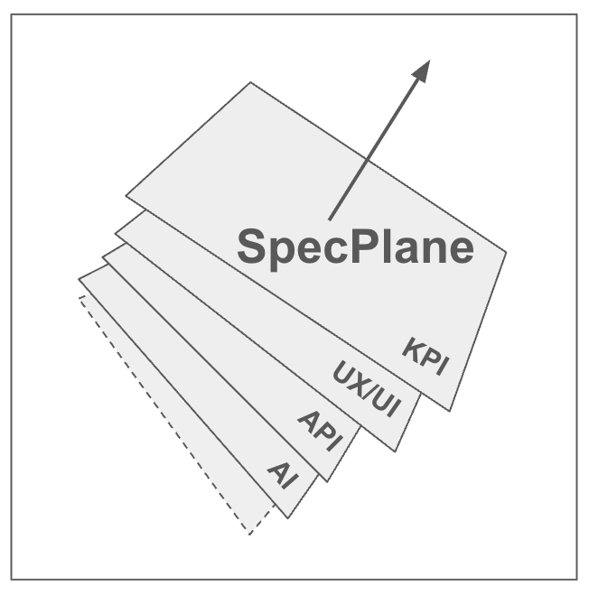

# SpecPlane

**The specification control plane for software teams**

SpecPlane is a flexible design-architecture framework for creating structured, machine-readable software specifications that bridge the gap between design thinking and implementation, transforming vague requirements into detailed, testable specifications that guide both human developers and AI coding assistants.



**SpecPlane helps align design, engineering, and product teams by providing a shared language and framework for capturing requirements, constraints, and success metrics across all aspects of product development.**

## Why SpecPlane Exists

**The Problem**: Design and implementation live in separate worlds. Figma mockups become stale, API documentation drifts from reality, and system requirements hide in Slack threads. Teams spend 50% of their engineering time on rework, debugging, and asking "why doesn't this work like the design?"

**The Solution**: SpecPlane creates Git-native YAML specifications that capture:
- **What** components should do (behavioral contracts)
- **How well** they should perform (constraints and SLOs)  
- **What can go wrong** and how to handle it (edge cases and error scenarios)
- **How success is measured** (acceptance criteria and observability)

The ultimate aim is to guide teams into thinking more deeply about core application behavior, constraints, and metrics when developing products, resulting in predictable and maintainable development processes.

## What SpecPlane Helps With

### For Development Teams
- **Eliminate design-implementation gaps** - Specifications ensure design decisions map to validated technical architecture
- **AI-Assisted Development** - Rich specifications prevent codegen drift by providing structured context for AI tools, ensuring generated code follows requirements instead of hallucinating intent
- **Cross-discipline alignment** - Ties product requirements, design intent, engineering specs, and observability metrics into one source of truth across product, design, engineering, and DevOps teams
- **Reduce rework cycles** - Comprehensive edge case analysis prevents common production issues
- **Developer discipline** - SpecPlane prompts help teams update specifications as code evolves, maintaining alignment between intent and implementation

### For Regulated Industries
- **Built-in compliance** - Automatic audit trails, requirement traceability, and governance documentation
- **Security by design** - Threat modeling and mitigation strategies embedded in specifications
- **Risk management** - Systematic analysis of failure modes and recovery strategies

### For Platform Teams
- **API consistency** - OpenAPI-compatible contracts ensure stable interfaces
- **Observability alignment** - SLIs and SLOs defined alongside functional requirements
- **Scalability planning** - Performance constraints and capacity planning built into specs

## Repository Structure

```
specplane/
├── specplane/              # Core SpecPlane schema and examples
│   ├── core_prompt/        # Master schema definitions and guidance
│   ├── specs/              # Example specifications
│   └── templates/          # Component type templates
├── specplane_viewer/       # Web-based specification viewer and validator
├── experiments/            # Research and validation studies
├── README.md              # This file
└── LICENSE                # Apache 2.0 License
```

## Quick Start

### 1. Learn the Schema
Start by reviewing the SpecPlane schema in [`specplane/core_prompt/`](./specplane/core_prompt/)

### 2. Explore Examples
Browse component specifications in [`specplane_viewer/specs/`](./specplane_viewer/specs/). We built a web-based viewer for specs.yaml files using the SpecPlane schema.

### 3. Try the Viewer
Use the web-based viewer in [`specplane_viewer/`](./specplane_viewer/) to validate and visualize specifications

### 4. Create Your First Spec
```yaml
meta:
  purpose: "User authentication interface with OAuth support"
  type: "widget"
  level: "component"
  domain: "frontend"

contracts:
  capabilities:
    - "Authenticate user with Google/Apple OAuth"
    - "Handle authentication failures gracefully"
    - "Navigate to dashboard on success"

constraints:
  performance:
    response_time: "<2s for OAuth flow completion"
  
  security_privacy:
    data_protection: "Only access email and profile picture"
    compliance: "GDPR consent required"

validation:
  acceptance_criteria:
    - "Shows loading state during OAuth flow"
    - "Displays specific error messages for failures"
    - "Redirects to onboarding for new users"
```

## Core Principles

**Bridges Design and Architecture**: SpecPlane makes spec-to-code relationships more visible and maintainable, reducing drift by evolving alongside applications and keeping design intent aligned with technical reality.

**Implementation-Agnostic**: Specifications focus on *what* and *how well*, not *how*. The same spec can guide web, mobile, and API implementations.

**Git-Native & Developer-Friendly**: Specifications live alongside code, are version-controlled, and integrate with existing development workflows.

**AI-Ready**: Rich, structured specifications become excellent context for AI coding tools, preventing hallucination and resulting in better generated code.

**Compliance-Ready**: Built for regulated industries with automatic audit trails and governance requirements.

**Observable**: Every specification includes monitoring, alerting, and success metrics from day one.

## Use Cases

### Component Specification
Document widgets, services, and system components with behavioral contracts, error handling, and performance requirements.

### System Architecture
Use C4 model integration to specify system context, container relationships, and deployment architecture.

### API Design
Create OpenAPI-compatible service contracts that stay synchronized with implementation.

### Compliance Documentation
Generate audit-ready documentation with requirement traceability and security analysis.

### AI Development Context
Transform specifications into rich prompts that help AI tools generate better, more maintainable code.

## Contributing

SpecPlane is open source and community-driven. We welcome contributions to:

- Core schema improvements
- Example specifications
- Integration tools
- Documentation and guides

See individual component READMEs for specific contribution guidelines.

## Research & Validation

The `experiments/` directory contains preliminary experiments validating SpecPlane's effectiveness in reducing development time and improving code quality. Initial findings show that structured specifications significantly improve AI-generated code quality and reduce post-implementation debugging.

## License

Apache 2.0 License - see [LICENSE](LICENSE) file for details.

## Learn More

- [Core Schema Documentation](./specplane/core_prompt/)
- [Example Specifications](./specplane_viewer/specs/)
- [Web Viewer](./specplane_viewer/)
- [Experimental Validation](./experiments/)

---

**Ready to align your design and implementation?**  
Start with the core schema guide and create your first specification.


> **🚧 Work in Progress** - This project is actively evolving and we're working to make SpecPlane more featureful and user friendly. We welcome feedback, contributions, and suggestions for improvement! Please share your experiences and help us build better tools for software specification and development.

