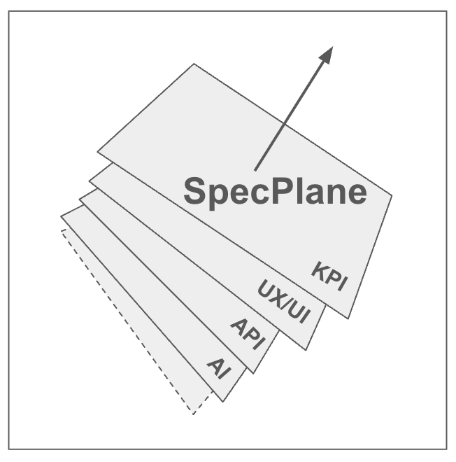

# SpecPlane

**Keep coding agents aligned with what you actually meant to build.**

It is a **git-native overlay of what a living product should do and how well** — not how it is implemented. You speak product language. The agent uses SpecPlane. You answer only consequential decisions.

**Free now:** kit, local kernel, skills, optional MCP. No SpecPlane API key.

**Later (not shipped):** spec coach, required GitHub check, viewer. Do not treat those as available today.



## The loop

You tell your coding agent:

> Reset links should expire in 15 minutes instead of 60.

SpecPlane **retrieves** the current promise, **classifies** this as an evolve (the live promise is 60 minutes), **blasts** what else is tied to that id, asks **one question** only if a decision is unresolved, and gives the agent the minimum context to **implement**. Then **check_sync** — did the change stay aligned with intent?

You do not operate the CLI. The coding agent does.

**Ask** — you speak product language.


**Impact** — blast shows who else is tied to that id.


**Ship** — implement, then check_sync.


### SpecPlane should stay out of your way

| You ask | What happens |
|---|---|
| “Fix the typo” | Agent just fixes it |
| “Rename this helper” | Agent just does it |
| “Reset links expire in 15m, not 60m” | SpecPlane tracks the product change |
| “Make destructive actions green” | SpecPlane warns if this changes a shared design rule |

Ceremony scales with **semantic consequence**, not diff size. Full transcript: [`docs/golden-journey.md`](./docs/golden-journey.md).

**Works with your coding agent.** Cursor, Claude Code, and Codex use the same deterministic kernel through **skills** today. Local MCP is available for the same retrieve / blast / check_sync / list_gaps tools when you want tool-native calls. You are not meant to type those commands.

## Try it

Synthetic example — not a real product, not this repo’s kernel `specs/`.

```bash
git clone https://github.com/gauravbaruah/SpecPlane.git
```

Open **`examples/tiny-saas`** as the workspace. Ask Cursor:

> Reset links should expire in 15 minutes instead of 60.

Auth, billing, notifications, one open billing change, and `src/auth.py` with a 60-minute reset TTL. Details: [`examples/tiny-saas/README.md`](./examples/tiny-saas/README.md) and [`docs/try.md`](./docs/try.md).

`blast` of a single id (not the whole loop): [docs/blast.gif](./docs/blast.gif).

## Use it in your product

From **your** app repo (not onto SpecPlane itself):

```bash
uvx --from git+https://github.com/gauravbaruah/SpecPlane.git@main specplane init
```

That command copies the kit and creates empty `specs/` folders. It does not copy SpecPlane’s own kernel `specs/`. Pin `@main` (or a commit SHA). There is no PyPI / `npx specplane` package.

If `uvx` is not installed: `python3 /path/to/SpecPlane/tools/specplane/cli.py init` from a checkout.

Then ask for a Phase 1 capability. Schema **v9.1.0**. More: [`docs/use-in-your-project.md`](./docs/use-in-your-project.md).

## Not this

Not a GRC or HIPAA company. Not OpenAPI-as-source-of-truth. Not “we cut rework by 50%.” Not a toy app you deploy. The Docusaurus viewer under `legacy/` is archived — do not resurrect it.

## This repository

| Path | What it is |
|---|---|
| `specplane/` | Kit — schema, applicable sections, foundation boilerplates |
| `specs/` | Kernel product — SpecPlane specifying its CLI. **Do not copy into other apps.** |
| `tools/specplane/` | Local CLI + MCP |
| `examples/tiny-saas/` | Synthetic overlay + small `src/` for the try path |
| `.agents/skills/` and `.cursor/skills/` | Same skills (keep identical) |
| `docs/golden-journey.md` | Intended human+agent loop |
| `legacy/` | Archived viewer — not the product path |

Default schema **v9.1.0** (Capability, System, Container, Component, plus Foundations). Agent loading: [`AGENTS.md`](./AGENTS.md). You do not need that ontology to try the loop.

## License

Apache 2.0 — see [LICENSE](LICENSE).
