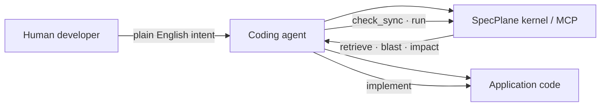
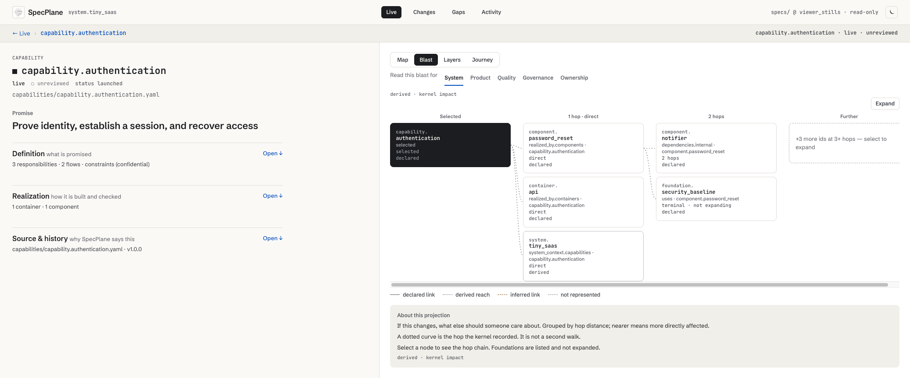
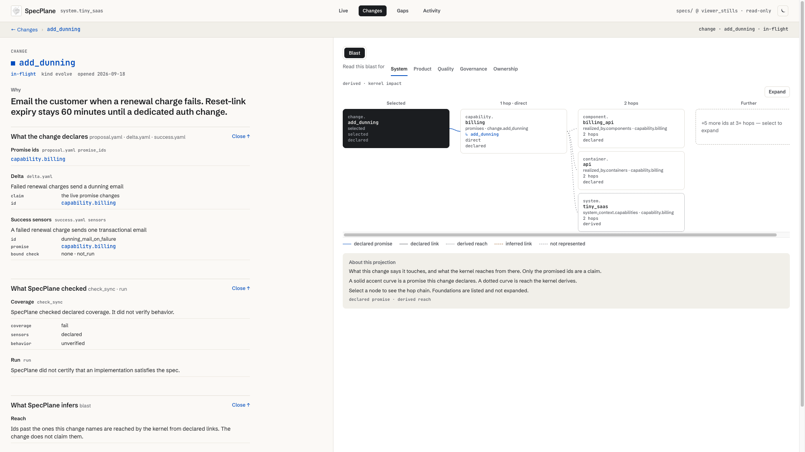

# SpecPlane

**Keep coding agents aligned with what you actually meant to build.**

[](https://github.com/gauravbaruah/SpecPlane/actions/workflows/specplane-toolkit.yml)
[](https://pypi.org/project/specplane/)
[](./LICENSE)

> We built SpecPlane because AI coding agents can write code faster than humans can maintain a coherent model of what the system is supposed to be. SpecPlane gives that model a structure—business capabilities, architecture, components, contracts, constraints, dependencies and evidence—and makes it explorable by humans and usable by agents.

SpecPlane is a git-native specification graph for software built by humans and AI agents.

Coding agents can change software extraordinarily quickly, but intent, architecture, constraints, tests, ownership, and evidence live in different places. SpecPlane keeps those relationships explicit and lets agents retrieve only the context relevant to a change.

Product intent, architecture, implementation, quality, governance, ownership, and evidence stay connected in one graph. Humans and agents work through the projections they need.

### In plain English

- **Capability:** What the product promises the user it can do.
- **Foundation:** Shared global rules (security, design tokens, error codes).
- **In-flight change:** A staging folder (`specs/changes/`) so experiments do not pollute live specs.
- **Sensor:** A real check or test bound to a promise (`must:` or a unit test). It is evidence, not a certificate.
- **blast:** what else this change may touch.
- **bit:** live, inferred, in-flight, or replaced.

The CLI, MCP, viewer, skills, and a pasted CI check are projections of one kernel.

**Free now:** kit, local kernel, skills, optional MCP, and `specplane view` (local, `127.0.0.1`, no API key).

Command events stay on this machine. `specplane usage report` prints the counts. Nothing leaves automatically.

**Later:** hosted share, a required GitHub check, and a spec coach. An optional paste-in check can ask whether a change is accounted for by declared intent and bound evidence. Init does not install it.

## Contents

- [Use it in your project](#use-it-in-your-project)
- [The loop](#the-loop)
- [Try the demo](#try-the-demo)
- [Optional: local MCP](#optional-local-mcp)
- [Not this](#not-this)
- [This repository](#this-repository)

## Use it in your project

Python 3.10 or newer. The current release is the pre-release `0.1.0a1`. There is no `npx` package.

```bash
pip install specplane
# or: uv tool install specplane
specplane init
```

From **your** app repo (not onto SpecPlane itself). `specplane init` copies the kit and creates empty `specs/` folders. It does not copy this repo’s kernel `specs/`. If the repo already has an `AGENTS.md`, init appends a block and leaves the rest of the file in place. Other skills stay.

To pin a commit instead of the published release: `uvx --from git+https://github.com/gauravbaruah/SpecPlane.git@<sha> specplane init`. The same shape with `@main` also works. Then ask for a capability: what the product should do, before any architecture. Schema **v9.1.0**. More: [`docs/use-in-your-project.md`](./docs/use-in-your-project.md).

### Advanced

If `uvx` is not installed, from a SpecPlane checkout:

```bash
pip install -e .
specplane init --dest /path/to/your-app
# or: python3 /path/to/SpecPlane/tools/specplane/cli.py init --dest /path/to/your-app
```

A hand copy of the toolkit (including `impact.py`, `view.py`, and `viewer/`) is the rsync fallback in [`docs/use-in-your-project.md`](./docs/use-in-your-project.md).

Already have a repo? Ask the agent to map what is here. That uses the **specplane-infer** skill: the agent walks one named root and writes at most seven Phase 1 capabilities tagged `inferred`, with path cites. You name which ids become live. The agent then runs `promote --ids`. SpecPlane does not ship a scan command. The coding agent does the walk.

Already know which files realize a component? Declare them as `implementation.realization.paths` (a repo-relative file, or a directory prefix ending in `/`). Maps are optional. Greenfield can declare maps without infer. `reconcile` reports a missing declared path and an unmapped changed app file. SpecPlane does not write your code, does not parse source to learn values, and does not turn an infer cite into a map. When a mapped file changes, `check_sync`'s default changed-set can include that component id. `--changed-ids` still overrides. A coverage pass is still declared coverage, not behavioral agreement. `reconcile` is a CLI command, not an MCP tool.

Issues are welcome when `pip install specplane` or the try path fails.

## The loop

You speak product language. The agent uses SpecPlane. You answer only consequential decisions.

You tell your coding agent:

> Reset links should expire in 15 minutes instead of 60.

SpecPlane **retrieves** the current promise, **classifies** this as an evolve (the live promise is 60 minutes), **blasts** what else is tied to that id, asks **one question** only if a decision is unresolved, and gives the agent the minimum context to **implement**. **Impact** reads that same subgraph as system, product, quality, governance, or ownership. Then **check_sync** — did the change stay aligned with the declared promise? If a success sensor already binds a check, **run** invokes that check and prints the evidence beside the claim. It does not certify the implementation.

You do not operate the CLI. The coding agent does.

### Before vs after

| Scenario | Standard AI coding agent | With SpecPlane |
| :--- | :--- | :--- |
| **Request:** *"Reset links expire in 15m"* | Agent edits `auth.py`, changes `60` → `15`, says "Done." | Agent calls `retrieve`, classifies **evolve**, and isolates the work in `specs/changes/`. |
| **Cross-system impact** | Tunnel vision. Misses who else is tied to that promise. | `blast` of the auth id names `capability.notifications`, `capability.billing`, `component.notifier`, and `foundation.security_baseline`. |
| **Documentation & audit** | Specs rot; live docs still say 60m. | In-flight change stays off live YAML. At accept, live spec gets a version bump and changelog. |
| **Verification** | Agent says everything looks good. | `check_sync` checks declared coverage. `run` invokes bound checks only and refuses to call that certification. |

### How the pieces fit


```mermaid
flowchart LR
  H[Human developer] -->|plain English intent| A[Coding agent]
  A --> K[SpecPlane kernel / MCP]
  A --> C[Application code]
  K -->|retrieve · blast · impact| A
  A -->|implement| C
  A -->|check_sync · run| K
```

**Ask** — you speak product language. **Impact** — blast names who else is tied to that id. The same subgraph can be read as system, product, quality, governance, or ownership. **Ship** — implement, then check_sync.

The terminal recordings are optional: [ask](./docs/ask.gif), [impact](./docs/impact.gif), [ship](./docs/ship.gif), [blast](./docs/blast.gif).

### SpecPlane should stay out of your way

| You ask | What happens |
|---|---|
| “Fix the typo” | Agent just fixes it |
| “Rename this helper” | Agent just does it |
| “Reset links expire in 15m, not 60m” | SpecPlane tracks the product change |
| “Make destructive actions green” | SpecPlane warns if this changes a shared design rule |
| “Map what’s already in this repo” | The agent uses **specplane-infer**, writes a handful of inferred capabilities, and waits for you to name which ids to promote |

Ceremony scales with **semantic consequence**, not diff size. Full transcript: [`docs/golden-journey.md`](./docs/golden-journey.md).

**Works with your coding agent.** Cursor, Claude Code, and Codex use the same deterministic kernel through **skills** today. Local MCP exposes retrieve, blast, impact, check_sync, list_gaps, and run when you want tool-native calls. You are not meant to type those commands.

## Try the demo

Synthetic example — not a real product, not this repo’s kernel `specs/`.

```bash
git clone https://github.com/gauravbaruah/SpecPlane.git
cd SpecPlane
pip install -e .
```

Python 3.10+. `pip install pyyaml` does not install a `specplane` command. Without the package, `python3 tools/specplane/cli.py --help` needs PyYAML importable and is still not `specplane` on PATH. The command needs the package above, `pip install -e .` from this checkout, or `python3 tools/specplane/cli.py` once PyYAML is importable. Walkthrough: [`docs/try.md`](./docs/try.md).

You say the change. The agent retrieves, blasts, and implements. You look at blast in `specplane view`.

Open **`examples/tiny-saas`** as the workspace. Ask Cursor:

> Reset links should expire in 15 minutes instead of 60.

Auth, billing, notifications, one open billing change, and `src/auth.py` with a 60-minute reset TTL. `retrieve` prints that sentence. The catch — an `auth.py` edit is invisible without a map or `--changed-ids`, and fails coverage when the map is present and no open change covers auth — is in [`docs/try.md`](./docs/try.md#4-the-catch). The last step opens the viewer on Blast for that id, which is what a 60→15 change puts at risk: [`docs/try.md`](./docs/try.md#5-what-the-change-puts-at-risk). Details: [`examples/tiny-saas/README.md`](./examples/tiny-saas/README.md).



This example already has an open billing change:



## Optional: local MCP

Skills already call the kernel. MCP is optional. Same six tools: retrieve, blast, impact, check_sync, list_gaps, run. Validate, promote, and reconcile stay CLI-only.

After `pip install -e .` from this checkout, `specplane mcp` starts that server. Optional `--spec-root` is the default when a tool call omits `spec_root`.

**Cursor** (`~/.cursor/mcp.json`) or **Claude Desktop** (`claude_desktop_config.json`):

```json
{
  "mcpServers": {
    "specplane": {
      "command": "specplane",
      "args": ["mcp"]
    }
  }
}
```

**Claude Code** — same JSON in the project `.mcp.json`, or:

```bash
claude mcp add specplane -- specplane mcp
```

From a checkout where `specplane` is not on PATH, `python3 tools/specplane/mcp_stdio.py` is the same server. In a product repo after `specplane init`, that script is `tools/specplane/mcp_stdio.py`. It adds its own directory to `sys.path`; PyYAML still has to be importable by that `python3`.

## Not this

Not a GRC or HIPAA company. Not OpenAPI-as-source-of-truth. Not “we cut rework by 50%.” Not a toy app you deploy. The Docusaurus viewer under `legacy/` is archived. Please leave it there.

## This repository

| Path | What it is |
|---|---|
| `specplane/` | Kit — schema, applicable sections, foundation boilerplates |
| `specs/` | Kernel product — SpecPlane specifying its own CLI. Your project gets its own `specs/`. Please leave this one here. |
| `tools/specplane/` | Local CLI, MCP, and `specplane view` |
| `tools/specplane/viewer/` | The shipping local viewer |
| `examples/tiny-saas/` | Synthetic overlay + small `src/` for the try path |
| `.agents/skills/` and `.cursor/skills/` | Same skills (keep identical) |
| `specplane/dialect.md` | Index of nouns, verbs, and the loop |
| `docs/dialect.md` | Pointer to that card |
| `docs/golden-journey.md` | Intended human+agent loop |
| `legacy/` | Archived viewer — not the product path |

Default schema **v9.1.0** (Capability, System, Container, Component, plus Foundations) is the structural model inside the graph. `impact` projects one affected subgraph as system, product, quality, governance, and ownership. Detail: [`docs/impact-perspectives.md`](./docs/impact-perspectives.md). Agent loading: [`AGENTS.md`](./AGENTS.md). You do not need that ontology to try the loop.

## License

Apache 2.0 — see [LICENSE](LICENSE).
